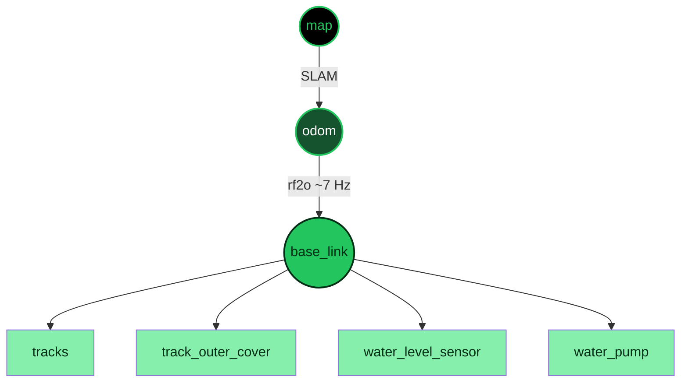
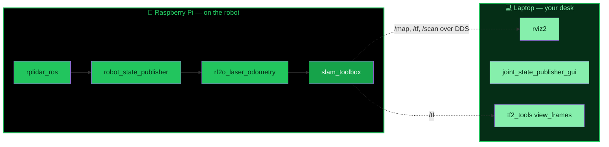

<div align="center">

<picture>
  <source media="(prefers-color-scheme: dark)" srcset="https://capsule-render.vercel.app/api?type=waving&color=0:000000,100:14532D&height=220&section=header&text=Agro_ros&fontSize=62&fontColor=22C55E&animation=fadeIn&desc=ROS%202%20Humble%20%E2%80%A2%20AgroBot%20Workspace&descAlignY=58&descColor=86EFAC" />
  <source media="(prefers-color-scheme: light)" srcset="https://capsule-render.vercel.app/api?type=waving&color=0:F0FDF4,100:22C55E&height=220&section=header&text=Agro_ros&fontSize=62&fontColor=052E16&animation=fadeIn&desc=ROS%202%20Humble%20%E2%80%A2%20AgroBot%20Workspace&descAlignY=58&descColor=065F46" />
  
</picture>

[;%F0%9F%97%BA%EF%B8%8F+2D+SLAM+Mapping+(slam_toolbox);%F0%9F%8D%93+%2B+%F0%9F%92%BB+Split+Deployment)](https://git.io/typing-svg)


<br/>


</div>


## 📖 Table of Contents

<table>
<tr>
<td width="50%" valign="top">

- [✨ Features](#-features)
- [🗂️ Repository Structure](#️-repository-structure)
- [🧠 TF Tree](#-tf-tree)
- [🖥️ System Layout — Laptop ↔ Raspberry Pi](#️-system-layout--laptop--raspberry-pi)
- [⚙️ Prerequisites](#️-prerequisites)

</td>
<td width="50%" valign="top">

- [🏗️ Build](#️-build)
- [▶️ Usage](#️-usage)
  - [🖥️ Mode A — Laptop Only](#️-mode-a--full-stack-on-the-laptop-only-no-raspberry-pi)
  - [🍓+💻 Mode B — Pi + Laptop](#-mode-b--split-raspberry-pi-sensors--laptop-visualization)
- [🧪 Verification & Debugging](#-verification--debugging)
- [🔧 Configuration](#-configuration)
- [🚧 Current Status & Known Issues](#-current-status--known-issues)
- [🗺️ Roadmap](#️-roadmap)
- [📄 License](#-license)

</td>
</tr>
</table>


## ✨ Features

<table>
<tr><td>🤖</td><td><b>Robot model</b></td><td>URDF (<code>Agrobot</code>) with five STL meshes — body, tracks, track outer cover, water pump, water-level sensor</td></tr>
<tr><td>📡</td><td><b>LiDAR odometry</b></td><td><a href="https://github.com/MAPIRlab/rf2o_laser_odometry"><code>rf2o_laser_odometry</code></a> turns <code>/scan</code> into <code>/odom</code> and publishes <code>odom → base_link</code></td></tr>
<tr><td>🗺️</td><td><b>2D SLAM</b></td><td><code>slam_toolbox</code> in mapping mode — Ceres solver, loop closure, 5 cm resolution, 0.2–12 m laser range</td></tr>
<tr><td>🌲</td><td><b>TF tree</b></td><td><code>map → odom → base_link → {tracks, track_outer_cover, water_level_sensor, water_pump}</code>, with a saved <code>view_frames</code> snapshot</td></tr>
<tr><td>🍓↔💻</td><td><b>Split deployment</b></td><td>LiDAR + odometry + SLAM run headless on the <b>Raspberry Pi</b> (on the robot); <b>RViz</b> and debugging tools run on your <b>laptop</b> over the network</td></tr>
</table>

## 🗂️ Repository Structure

```text
Agro_ros/
├── src/Agro_ros/                 # ament_python package
│   ├── Agro_ros/                 # Python module (placeholder)
│   ├── urdf/robot.urdf           # Robot description
│   ├── meshes/                   # STL parts (scaled ×0.05 in URDF)
│   │   ├── agro_ros_body.stl
│   │   ├── agro_ros_tracks.stl
│   │   ├── agro_ros_tracks_outer_cover.stl
│   │   ├── agro_ros_water_pump.stl
│   │   └── agro_ros_water_level_sensor.stl
│   ├── slam_params.yaml          # slam_toolbox parameters
│   ├── package.xml · setup.py · setup.cfg · resource/ · test/
├── rf2o_params.yaml               # rf2o laser odometry parameters
├── command.txt                    # Handy ROS 2 commands (laptop + Raspberry Pi)
├── frames_2026-09-18_20.48.39.{gv,pdf}   # TF tree snapshot (view_frames)
└── LICENSE                        # MIT
```

> `build/`, `install/` and `log/` are colcon outputs — regenerated on every build, not tracked as source.

## 🧠 TF Tree



`map → odom` comes from SLAM, `odom → base_link` from rf2o (~7 Hz), and the `base_link` children are fixed joints from the URDF.

## 🖥️ System Layout — Laptop ↔ Raspberry Pi

AgroBot runs **split across two machines** on the same ROS 2 network (same `ROS_DOMAIN_ID`, Wi-Fi/LAN):



- **Raspberry Pi**: has the physical LiDAR wired in (`/dev/ttyUSB*`), so it hosts the driver, odometry and SLAM.
- **Laptop**: has no hardware attached — it just visualizes the topics the Pi publishes, and is handy for one-off debugging (joint GUI, TF snapshots).
- Make sure both machines export the same `ROS_DOMAIN_ID` and can reach each other on the network before starting anything.


## ⚙️ Prerequisites

<table>
<tr><th align="left">🍓 Raspberry Pi</th><th align="left">💻 Laptop</th></tr>
<tr><td valign="top">

- Raspberry Pi OS / Ubuntu 22.04 + ROS 2 Humble
- `colcon`
- 2D LiDAR wired in, publishing `sensor_msgs/LaserScan` on `/scan`

```bash
sudo apt update
sudo apt install ros-humble-robot-state-publisher \
                 ros-humble-slam-toolbox \
                 ros-humble-rplidar-ros
```

</td><td valign="top">

- Ubuntu 22.04 + ROS 2 Humble
- `rviz2`, `tf2_tools`, `joint_state_publisher_gui`

```bash
sudo apt update
sudo apt install ros-humble-rviz2 \
                 ros-humble-tf2-tools \
                 ros-humble-joint-state-publisher-gui
```

</td></tr>
</table>

`rf2o_laser_odometry` isn't bundled in this repo; clone it into the workspace `src/` **on the Raspberry Pi**:

```bash
git clone -b ros2 https://github.com/MAPIRlab/rf2o_laser_odometry.git src/rf2o_laser_odometry
```

## 🏗️ Build

Run this on **whichever machine** will launch the nodes (build it on the Pi, and on the laptop if you want the URDF/meshes locally for RViz):

```bash
git clone https://github.com/AakashKavediya/Agro_ros.git
cd Agro_ros
git clone -b ros2 https://github.com/MAPIRlab/rf2o_laser_odometry.git src/rf2o_laser_odometry

source /opt/ros/humble/setup.bash
colcon build
source install/setup.bash
```

**On the Pi**, the active workspace lives at `~/ros` (the repo's own `~/ros/Agro_ros` clone is a separate checkout — don't confuse the two, see the note in [Usage](#-usage)). To rebuild after a source change on the Pi:

```bash
cd ~/ros

unset AMENT_PREFIX_PATH
unset CMAKE_PREFIX_PATH
unset COLCON_PREFIX_PATH

source /opt/ros/humble/setup.bash
colcon build --symlink-install

source ~/ros/install/setup.bash
```


## ▶️ Usage

Two ways to run the stack, depending on whether the LiDAR is plugged into your laptop or into the robot's Pi.

### 🖥️ Mode A — Full Stack on the Laptop Only (no Raspberry Pi)

Use this when the LiDAR is plugged directly into your **laptop's** USB port — everything runs on one machine, no SSH, no `ROS_DOMAIN_ID` juggling. Build once from the repo root:

```bash
source /opt/ros/humble/setup.bash
colcon build
source install/setup.bash
```

Then open **5 terminals**, each sourced from the repo root:

```bash
source /opt/ros/humble/setup.bash
source install/setup.bash
```

**Terminal 1 — LiDAR:**

```bash
ls -l /dev/ttyUSB* /dev/ttyACM* 2>/dev/null    # confirm it's connected
dmesg | tail -30

ros2 run rplidar_ros rplidar_composition --ros-args \
  -p serial_port:=/dev/ttyUSB0 \
  -p serial_baudrate:=115200 \
  -p frame_id:=base_link \
  -p angle_compensate:=true
```

**Terminal 2 — robot model:**

```bash
ros2 run robot_state_publisher robot_state_publisher \
  --ros-args \
  -p robot_description:="$(cat src/Agro_ros/urdf/robot.urdf)"
```

**Terminal 3 — LiDAR odometry:**

```bash
ros2 run rf2o_laser_odometry rf2o_laser_odometry_node \
  --ros-args \
  --params-file rf2o_params.yaml
```

**Terminal 4 — SLAM mapping:**

```bash
ros2 launch slam_toolbox online_sync_launch.py \
  slam_params_file:=src/Agro_ros/slam_params.yaml \
  use_sim_time:=false
```

**Terminal 5 — visualize:**

```bash
rviz2
```

> 💡 Handy extras, still on the laptop: refresh the model after editing `robot.urdf` → `colcon build && source install/setup.bash && ros2 run robot_state_publisher robot_state_publisher src/Agro_ros/urdf/robot.urdf`; inspect joints without hardware → `ros2 run joint_state_publisher_gui joint_state_publisher_gui`; snapshot the TF tree → `ros2 run tf2_tools view_frames`.


### 🍓+💻 Mode B — Split: Raspberry Pi (sensors) + Laptop (visualization)

> ⚠️ **Every Pi terminal starts the same way.** SSH into the Raspberry Pi first, then run this block *before* any `ros2` command below:
>
> ```bash
> source /opt/ros/humble/setup.bash
> source ~/ros/install/setup.bash
>
> export ROS_DOMAIN_ID=0
> export ROS_LOCALHOST_ONLY=0
> unset FASTRTPS_DEFAULT_PROFILES_FILE
> ```
>
> ❌ Do **not** source `~/ros/Agro_ros/install/setup.bash` — that's the repo's own local build, not the active workspace. The correct install is `~/ros/install`.

#### 🍓 On the Raspberry Pi (SSH in)

Open **4 terminals** on the Pi (each starts with the block above) — one node per terminal, in order.

**Terminal 1 — check the LiDAR is connected, then start it:**

```bash
ls -l /dev/ttyUSB*

ros2 run rplidar_ros rplidar_composition --ros-args \
  -p serial_port:=/dev/ttyUSB0 \
  -p serial_baudrate:=115200 \
  -p frame_id:=base_link \
  -p angle_compensate:=true
```

| | |
|---|---|
| Device | `/dev/ttyUSB0` (Silicon Labs CP2102 bridge, USB ID `10c4:ea60`) |
| Driver / executable | `rplidar_ros` → `rplidar_composition` |
| Topic / message | `/scan` → `sensor_msgs/msg/LaserScan` |
| Frame · baud rate | `base_link` · `115200` |

**Terminal 2 — publish the robot model:**

```bash
ros2 run robot_state_publisher robot_state_publisher \
  --ros-args \
  -p robot_description:="$(cat ~/ros/Agro_ros/src/Agro_ros/urdf/robot.urdf)"
```

Publishes the static TF structure: `map → odom → base_link → {tracks, track_outer_cover, water_level_sensor, water_pump}`.

**Terminal 3 — start LiDAR odometry:**

```bash
ros2 run rf2o_laser_odometry rf2o_laser_odometry_node \
  --ros-args \
  --params-file ~/ros/Agro_ros/rf2o_params.yaml
```

`/scan` → **rf2o** → `/odom` → publishes `odom → base_link` (~7 Hz).

**Terminal 4 — start SLAM mapping:**

```bash
ros2 launch slam_toolbox online_sync_launch.py \
  slam_params_file:=~/ros/Agro_ros/src/Agro_ros/slam_params.yaml \
  use_sim_time:=false
```

`/scan` + `odom → base_link` → **slam_toolbox** → `/map` (~1 Hz).

> 💡 Sanity-check the map topic is alive from any terminal: `ros2 topic info /map` and `ros2 topic echo /map --once`.

#### 💻 On the Laptop (visualization only)

Make sure `ROS_DOMAIN_ID` matches the Pi's and you're on the same network.

**Visualize everything the Pi is publishing** — runs directly on the laptop, no SSH:

```bash
source /opt/ros/humble/setup.bash
source ~/ros/install/setup.bash

export ROS_DOMAIN_ID=0
export ROS_LOCALHOST_ONLY=0
unset FASTRTPS_DEFAULT_PROFILES_FILE

rviz2
```

In RViz: set **Global Options → Fixed Frame** to `map`, then add these displays:

| Display | Topic |
|---|---|
| Map | `/map` |
| LaserScan | `/scan` |
| Odometry | `/odom` |
| RobotModel | `/robot_description` |
| TF | — |

> 💡 The joint-GUI / model-refresh / TF-snapshot extras from Mode A work here too — just run them on the laptop.


## 🧪 Verification & Debugging

Run these from any sourced terminal (Pi or laptop) to confirm the stack is healthy.

<details>
<summary><b>📋 Topics</b></summary>

```bash
ros2 topic list
```

Expect to see `/map`, `/odom`, `/scan`, `/tf`, `/tf_static`, `/robot_description`.

</details>

<details>
<summary><b>📡 LiDAR — <code>/scan</code></b></summary>

```bash
ros2 topic echo /scan
ros2 topic hz /scan     # expect ~7 Hz
```

</details>

<details>
<summary><b>🧭 Odometry — <code>/odom</code></b></summary>

```bash
ros2 topic echo /odom
ros2 topic hz /odom     # expect ~7 Hz
```

</details>

<details>
<summary><b>🗺️ SLAM map — <code>/map</code></b></summary>

```bash
ros2 topic echo /map
ros2 topic hz /map      # expect ~1 Hz
```

</details>

<details>
<summary><b>🌲 TF tree</b></summary>

```bash
ros2 run tf2_tools view_frames          # writes frames_<timestamp>.gv / .pdf
ros2 run tf2_ros tf2_echo odom base_link
ros2 run tf2_ros tf2_echo map base_link
```

</details>

<details>
<summary><b>⚙️ Nodes</b></summary>

```bash
ros2 node list
```

Expect `rplidar_node`, `robot_state_publisher`, `/CLaserOdometry2DNode`, `slam_toolbox`.

```bash
ros2 node info /CLaserOdometry2DNode
```

</details>

<details>
<summary><b>📦 Package installation</b></summary>

```bash
ros2 pkg prefix rplidar_ros
ros2 pkg prefix slam_toolbox
ros2 pkg prefix rf2o_laser_odometry
ros2 pkg prefix Agro_ros
```

</details>

<details>
<summary><b>🔌 LiDAR USB device</b></summary>

```bash
ls -l /dev/ttyUSB*
lsusb
```

Should show `/dev/ttyUSB0`, USB bridge **Silicon Labs CP2102** (`10c4:ea60`).

</details>


## 🔧 Configuration

| File | Purpose | Key values |
|---|---|---|
| `rf2o_params.yaml` | rf2o odometry | `/scan` → `/odom`, `base_link`/`odom` frames, `publish_tf: true`, `freq: 7.0` |
| `src/Agro_ros/slam_params.yaml` | slam_toolbox | `mode: mapping`, Ceres solver, `resolution: 0.05`, laser range 0.20–12.0 m, loop closing on, min travel 0.05 m / 0.05 rad |
| `src/Agro_ros/urdf/robot.urdf` | Robot description | 5 links, all fixed joints to `base_link`, meshes scaled ×0.05 |

## 🚧 Current Status & Known Issues

- ✅ Robot model loads in RViz; the robot moves with LiDAR odometry.
- ⚠️ **`/map` is not yet being generated** by SLAM (latest commit) — check `/scan` frame, `odom → base_link` TF timing, and the `scan_topic` in `slam_params.yaml`.
- ⚠️ Joints are all `fixed` with zero origins — wheel/track motion isn't modelled yet.
- ⚠️ `setup.py` installs `launch/*.py`, but no `launch/` folder exists yet.
- ⚠️ `package.xml` still has a TODO description/license, and `entry_points` is empty.

## 🗺️ Roadmap

- [ ] Fix map generation (check `/scan` frame, `odom → base_link` TF timing, and slam_toolbox `scan_topic`)
- [ ] Add a launch file bringing up robot_state_publisher + rf2o + slam_toolbox in one shot on the Pi
- [ ] Add a saved RViz config for the laptop side
- [ ] Model track/wheel joints and add differential-drive control
- [ ] Add sensors (IMU, camera) and water pump / level-sensor interfaces
- [ ] Add `.gitignore` for `build/ install/ log/`

## 📄 License

MIT — see [LICENSE](LICENSE). © 2026 Aakash Kavediya.

<div align="center">
<picture>
  <source media="(prefers-color-scheme: dark)" srcset="https://capsule-render.vercel.app/api?type=waving&color=0:14532D,100:000000&height=140&section=footer&text=Made%20with%20%F0%9F%8C%B1%20for%20smarter%20farms&fontSize=18&fontColor=86EFAC" />
  <source media="(prefers-color-scheme: light)" srcset="https://capsule-render.vercel.app/api?type=waving&color=0:22C55E,100:F0FDF4&height=140&section=footer&text=Made%20with%20%F0%9F%8C%B1%20for%20smarter%20farms&fontSize=18&fontColor=052E16" />
  
</picture>
</div>